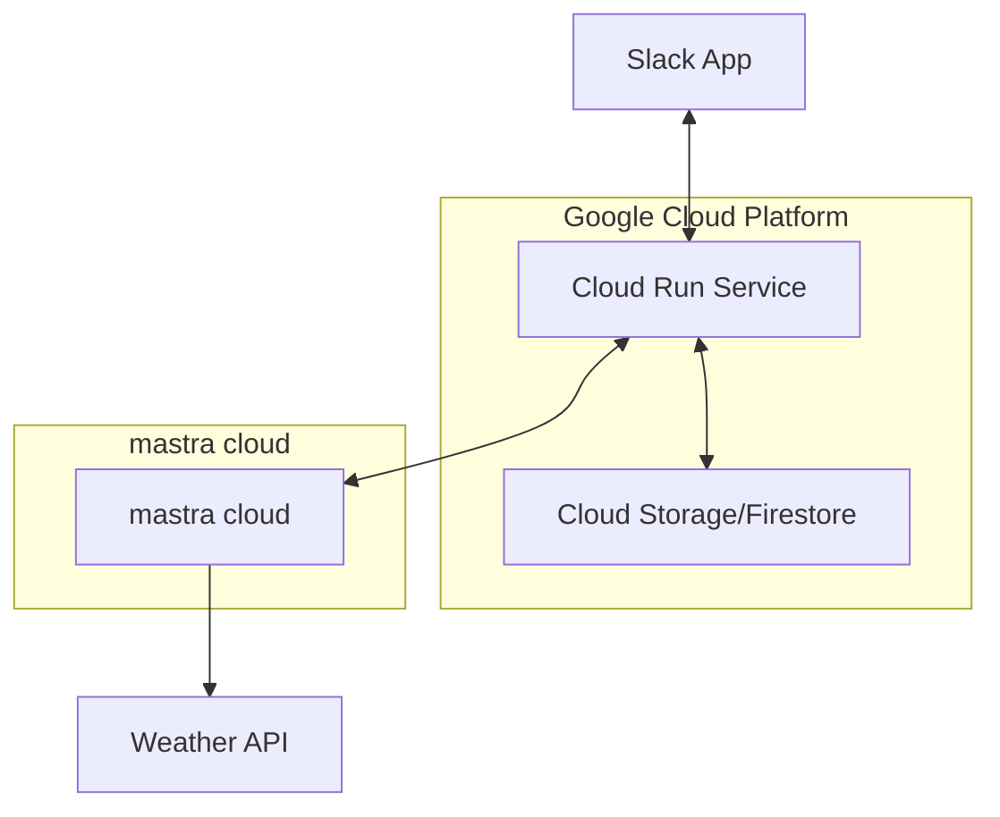
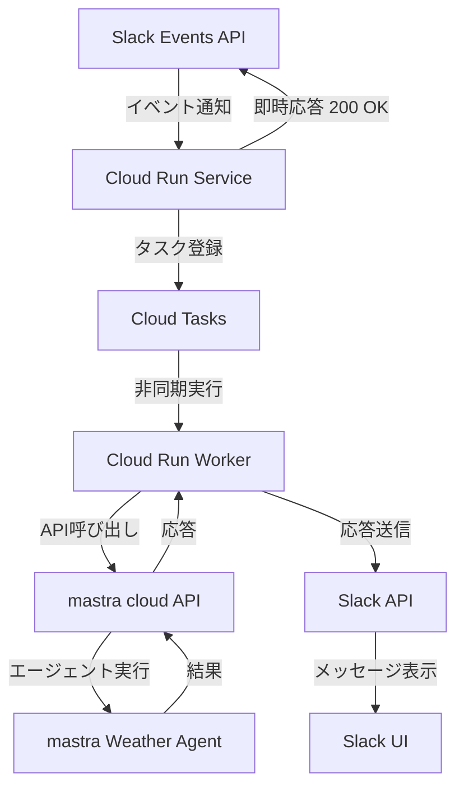

# mastra を利用した Slack 経由の天気情報 AI エージェント - アーキテクチャ設計

## 概要

このドキュメントでは、mastra cloud を利用して Slack 経由で利用できる天気情報 AI エージェントのアーキテクチャ設計について説明します。このシステムは Slack App、Google Cloud Platform、および mastra cloud のハイブリッドクラウド構成で実装され、ユーザーが Slack から天気に関する質問をすると、AI エージェントが適切な応答を返します。

## アーキテクチャ図

## 非同期処理アーキテクチャ

Slack Events API の 3 秒タイムアウト制約に対応するため、非同期処理アーキテクチャを採用します：

## コンポーネント詳細

### 1. Slack App

- **機能**: ユーザーとのインターフェース
- **実装**: Slack Bolt for JavaScript
- **主要機能**:
  - メッセージの受信と送信
  - ユーザー認証
  - イベント処理（メンション、ダイレクトメッセージなど）

### 2. Cloud Run Service

- **機能**: アプリケーションのホスティングと実行
- **実装**: Node.js + Express
- **主要機能**:
  - Slack からのリクエスト処理
  - Cloud Tasks へのタスク登録
  - 一時応答メッセージの送信

### 3. Cloud Tasks

- **機能**: 非同期タスク管理
- **実装**: Google Cloud Tasks
- **主要機能**:
  - タスクのキューイング
  - 再試行ポリシーの管理
  - ワーカーサービスへのタスク配信

### 4. Cloud Run Worker

- **機能**: バックグラウンド処理の実行
- **実装**: Node.js + Express（別の Cloud Run サービス）
- **主要機能**:
  - mastra cloud API の呼び出し
  - 長時間実行タスクの処理
  - Slack API を使用した応答送信

### 5. mastra cloud

- **機能**: AI エージェントのホスティングと実行
- **実装**: mastra のマネージドサービス
- **主要機能**:
  - Weather Agent の実行
  - 天気情報の取得と整形
  - レスポンス生成

### 6. Weather API

- **機能**: 実際の天気データの提供
- **実装**: Open-Meteo API（mastra cloud 内のエージェントから呼び出し）
- **主要機能**:
  - 位置情報に基づく天気データの提供

### 7. Cloud Storage/Firestore

- **機能**: データの永続化（必要に応じて）
- **実装**: Google Cloud Firestore
- **主要機能**:
  - 会話履歴の保存（mastra cloud の機能で代替可能）
  - ユーザー設定の保存
  - その他のメタデータ管理

## データフロー

1. ユーザーが Slack でボットにメッセージを送信
2. Slack Events API が Cloud Run Service にイベントを通知
3. Cloud Run Service が即座に応答し、一時メッセージを送信
4. Cloud Run Service が Cloud Tasks にタスクを登録
5. Cloud Tasks が Cloud Run Worker にタスクを配信
6. Cloud Run Worker が mastra cloud API を呼び出し
7. mastra cloud がエージェントを実行し、必要に応じて天気情報を取得
8. mastra cloud がレスポンスを Cloud Run Worker に返却
9. Cloud Run Worker が Slack API を使用して最終応答を送信

## 技術スタック

1. **フロントエンド**:

   - Slack UI（既存の Slack インターフェース）

2. **バックエンド**:

   - Node.js
   - Express
   - Bolt for JavaScript（Slack API 連携）
   - mastra client-js（mastra cloud API 連携）

3. **AI/ML**:

   - mastra cloud 上のエージェント
   - Google Gemini（mastra cloud で使用）

4. **データストレージ**:

   - Google Cloud Firestore（必要に応じて）
   - mastra cloud の組み込みストレージ（会話履歴など）

5. **デプロイ/インフラ**:
   - Google Cloud Run
   - Google Cloud Tasks
   - mastra cloud

## 実装上の考慮事項

### 1. mastra cloud の設定

- mastra cloud 上でのエージェント作成と設定
- API キーの取得と安全な管理
- エージェント ID の管理

### 2. 非同期処理

- Slack Events API の 3 秒タイムアウト制約に対応するため、非同期処理パターンを採用
- 一時応答メッセージを即座に送信し、バックグラウンドで処理を継続

### 3. スケーラビリティ

- Cloud Run の自動スケーリング機能を活用
- Cloud Tasks によるタスクの分散と制御
- mastra cloud の自動スケーリング機能の活用

### 4. 信頼性

- タスク処理の再試行機能
- エラー処理の改善
- 適切なログ記録とモニタリング

### 5. セキュリティ

- Slack 署名検証によるリクエスト認証
- サービスアカウントによるサービス間認証
- mastra cloud API キーの安全な管理
- 環境変数による機密情報の管理
